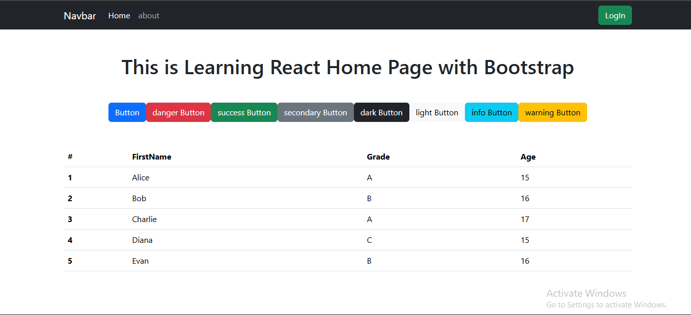

# React_Class-02 

### What i learn:

- create project
- install sass & bootstrap  ``` npm i sass bootstrap```
- folder structure 
- compontents
- props
- destructuring props
- ternary Operator 
- template literal
- map()



